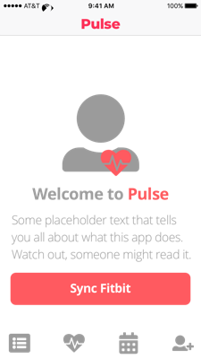
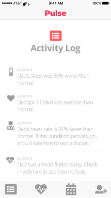
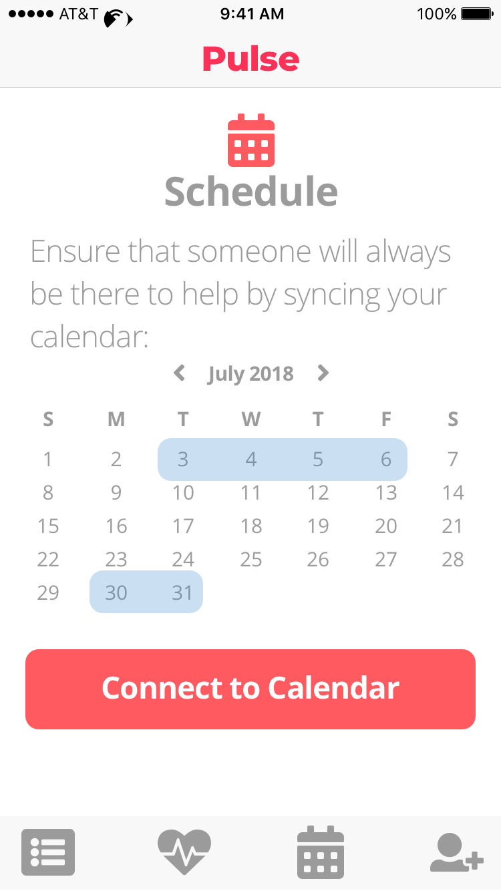
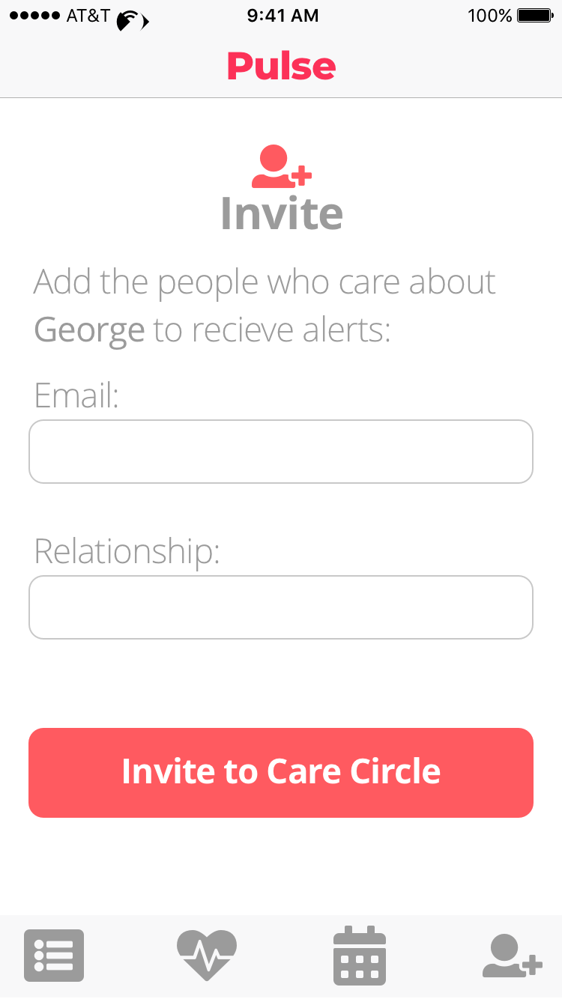
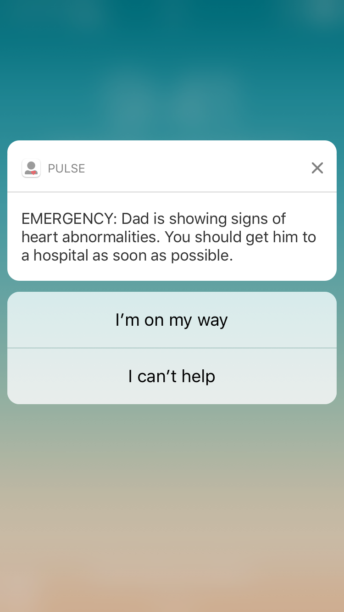
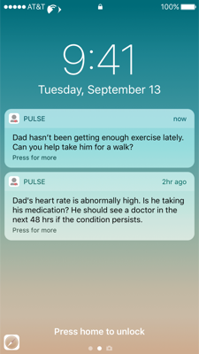
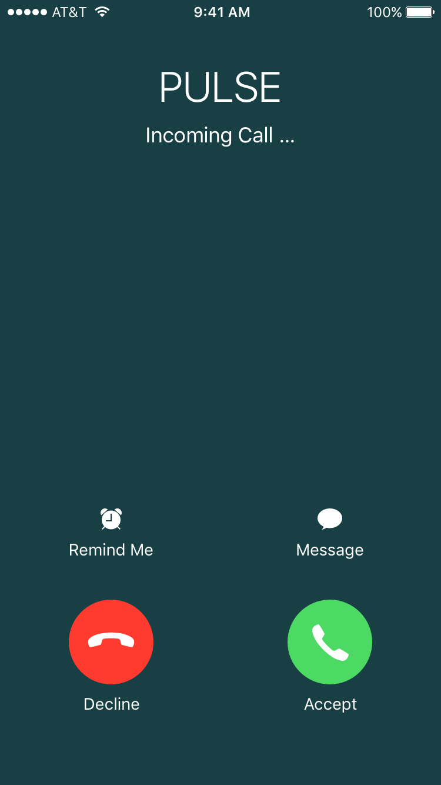

#TC Disrupt Novartis Entry

This is the front end of a submission for the TechCrunch Disrupt's 2018 Hackathon. It is built in react native.

## Challenge Information

The Novartis Challenge, as taken directly from the [Hackathon Page](https://disruptsf2018.devpost.com/details/sponsorprizes) states "
The Challenge – Help us Empower Heart Failure Patients and save lives!

Heart failure is a chronic debilitating and potentially life-threatening disease affecting 26 million people worldwide. It is one of the most difficult and chronic heart diseases to manage and the biggest cause of hospital admissions in adults aged over 65 in the Western world (Source: Heart Failure). As a result, treatment costs, including hospitalizations, are estimated at $108 billion a year worldwide. About 25% of patients die within a year of diagnosis and 50% within five years (Source: CDC and WHO).

What we’re looking for is a digital solution to help better monitor, manage and even predict worsening symptoms of heart failure. After a patient is diagnosed with heart failure, there are very few resources available to easily and unobtrusively monitor their heart health over time. Adherence to therapy and lack of health interventions are major reasons why patients’ health often deteriorates rapidly after a diagnosis. This solution should therefore drastically reduce the number of hospital readmissions and deaths following an initial diagnosis.

Help us reimagine medicine by using your creativity and tech skills to develop a tool that easily captures important cardiovascular vitals and monitors symptom progression, empowering patients to detect potential problems earlier and seek treatment sooner. We’re looking for accessible, affordable, and easy to use technologies that can seamlessly integrate into the life of a patient who has recently been diagnosed with heart failure. Use of personal digital devices (smart phones, smart watches, etc.), telemedicine, and innovative patient engagement are encouraged.

What we are not looking for is a diagnostic device that (a) is not a standard consumer device (e.g. a non-commercial wearable) and (b) increases the burden and involvement of a patient in monitoring their disease."

## Idea & Design

Our solution to the challenge was to create an app for the families & friends of those suffering from heart conditions. Using a fitbit to collect heartbeat and health data, we can port that information to an app for family and friends to help moniter and care for the heart patient.

Additional notifications are sent when anomolies in heartbeat data are detected, allowing the team of family and friends to help one suffering from heart disease take preventative measures.

## Running the App

Clone the repo, cd into the folder and run `yarn install`. You then have the choice of the following:

* yarn start: Starts the development server so you can open your app in the Expo app on your phone.

* yarn run ios: (Mac only, requires Xcode) Starts the development server and loads your app in an iOS simulator.

* yarn run android (Requires Android build tools) Starts the development server and loads your app on a connected Android device or emulator.
